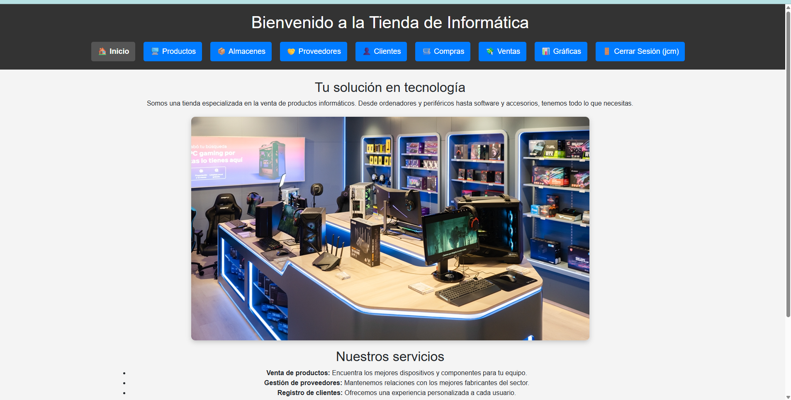
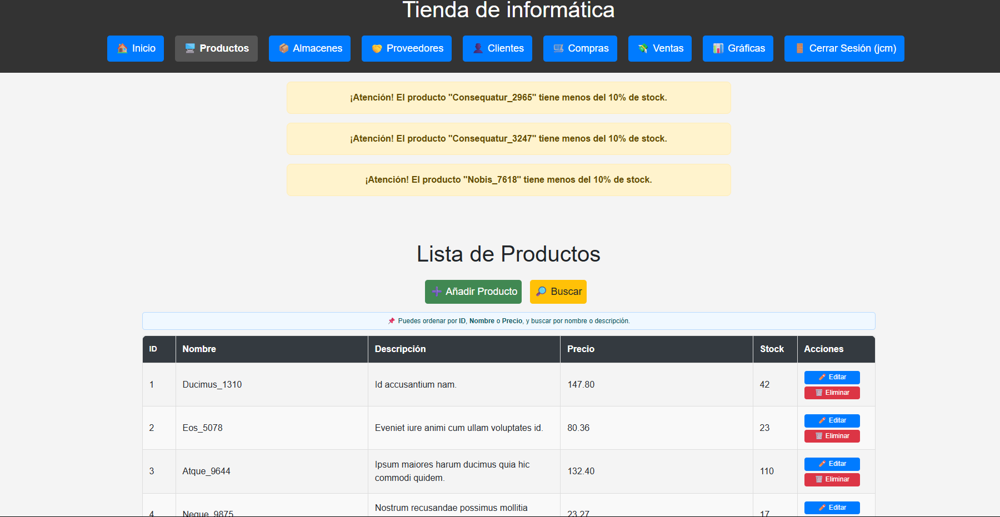
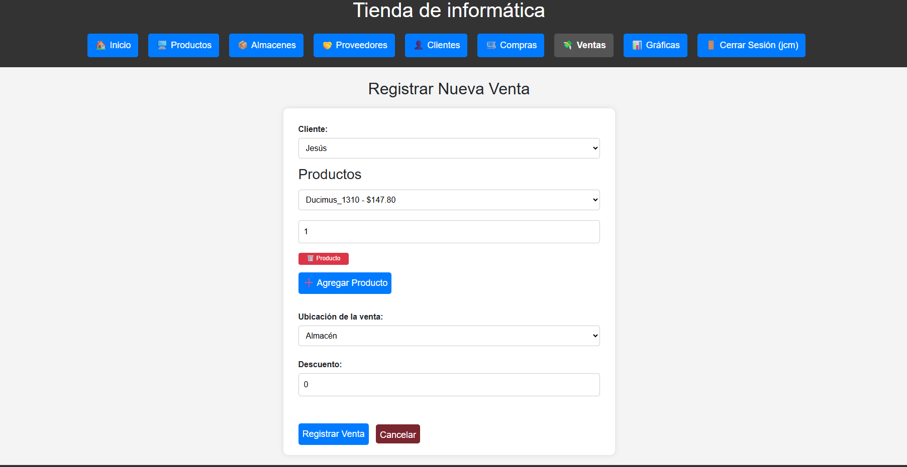
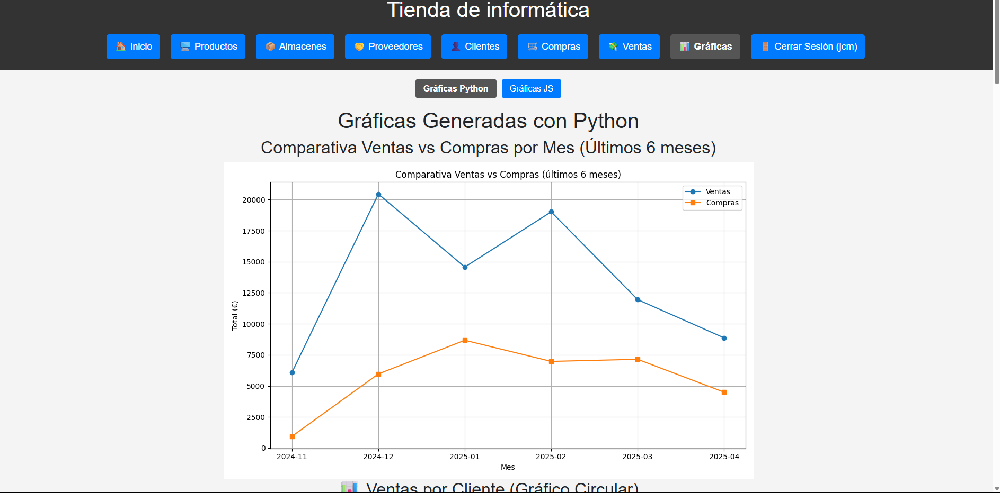
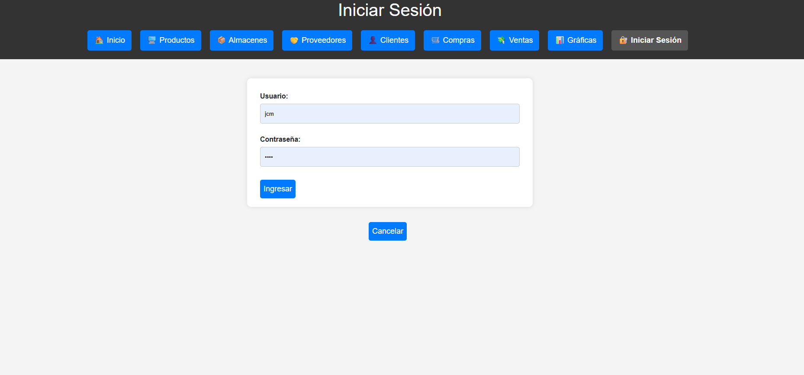
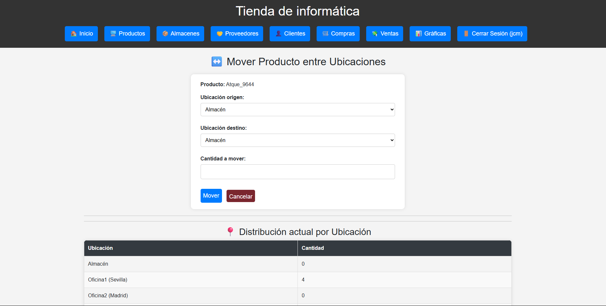

# 🛍️ Tienda Informática - Proyecto Flask

Este es un proyecto web desarrollado con **Python + Flask**, diseñado para la gestión integral de una tienda de suministros informáticos. Permite gestionar productos, clientes, proveedores, ventas, compras y visualización de gráficas.

---

## 🌐 Tecnologías utilizadas

- **Python 3.10**
- **Flask** (framework web)
- **SQLAlchemy** (ORM para base de datos)
- **SQLite** (base de datos ligera)
- **Matplotlib** (gráficas en Python)
- **Chart.js** (gráficas dinámicas en JavaScript)
- **HTML + CSS** (interfaz de usuario)
- **JavaScript** (interactividad, formularios y fetch)
- **Render** (deploy en la nube)

---

## 🚀 Acceso online al proyecto

Puedes ver la aplicación funcionando aquí:  
👉 [https://proyectoinformatica.onrender.com/](https://proyectoinformatica.onrender.com/)

---

## 📁 Estructura del proyecto

```
ProyectoInformatica/
├── main.py                # Entrada principal de la aplicación Flask
├── db.py                  # Definición de modelos y funciones de autenticación
├── routes/                # Módulos de rutas separados por funcionalidad
│   ├── clientes.py
│   ├── productos.py
│   ├── ventas.py
│   ├── compras.py
│   └── ...
├── templates/             # Archivos HTML organizados por secciones
├── static/                # Archivos estáticos: CSS, JS, gráficas, imágenes
│   ├── css/
│   ├── js/
│   └── images/readme/
├── requirements.txt       # Lista de dependencias para instalar
└── Procfile               # Indicación para Render de cómo ejecutar la app
```

---

## ✅ Características implementadas

- Autenticación de usuarios (admin y cliente)
- Registro, edición y eliminación de clientes, productos, proveedores
- Registro de ventas y compras con control de stock
- Gráficas de:
  - Ventas por producto
  - Compras por proveedor
  - Evolución mensual
  - Comparativa compras vs ventas
  - Distribución por cliente
- Control de acceso por rol
- Estilo limpio, intuitivo y adaptado a escritorio

---

## 🧪 Instalación local (opcional)

```bash
# 1. Clona el repositorio
git clone https://github.com/tu-usuario/ProyectoInformatica.git
cd ProyectoInformatica

# 2. Crea un entorno virtual
python -m venv .venv
source .venv/bin/activate   # En Windows: .venv\Scripts\activate

# 3. Instala las dependencias
pip install -r requirements.txt

# 4. Ejecuta la aplicación
python main.py
```

---

## 📦 Deploy automático con Render

Este proyecto está configurado para desplegarse automáticamente desde GitHub usando:
- `requirements.txt`
- `Procfile`
- Soporte para `PORT` dinámico

---

## 📸 Capturas de pantalla

### Inicio


### Productos


### Nueva Venta


### Gráficas


### Sesión


### Mover entre tiendas


---

## 📄 Licencia

Este proyecto es parte de un curso de desarrollo en Python y puede ser utilizado con fines educativos y demostrativos. Puedes adaptarlo libremente.
